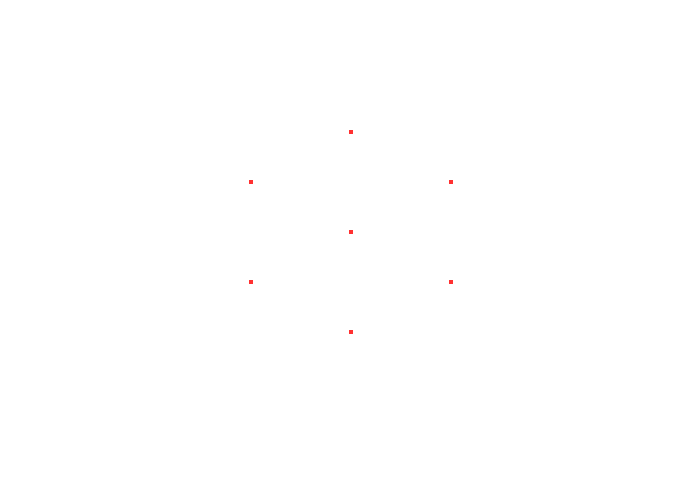

Das Prinzip der Rotation ist ziemlich einfach:

Wir haben 8 Punkte, von denen wir eine Ovale Bahn berechnen, 
die dann auf die Pixel-Dimensionen des Fensters projiziert werden.

Die Pixel werden mit den Koordinaten und einer Farbe auf dem weißen Hintergrund gezeichnet.
In jeder nächsten Iteration werden die Koordinaten der Roten Pixel aus dem vorherigen Iterationsschritt mit weiß übermalt und natürlich die neuen Pixel auf den neuen Koordinaten gezeichnet.

